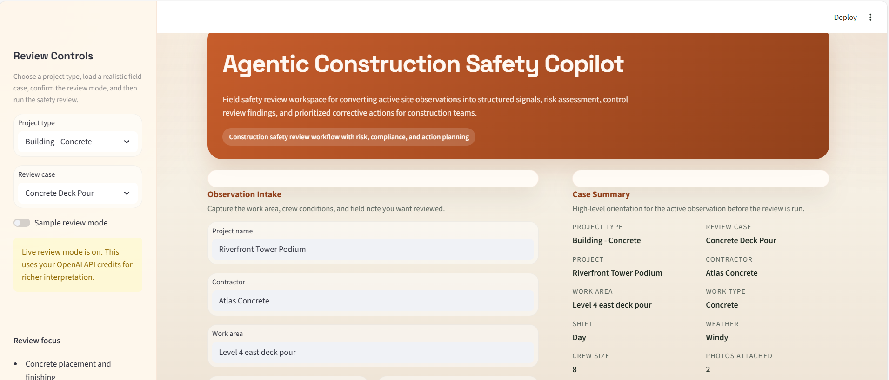
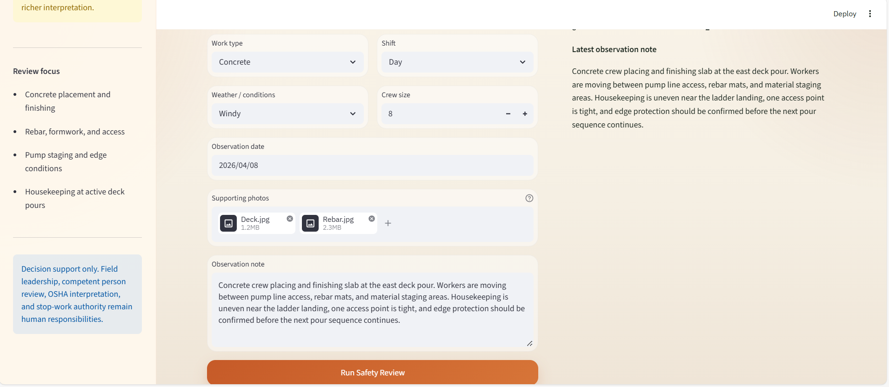
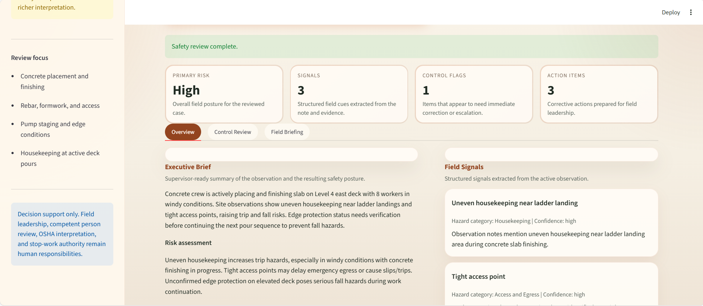
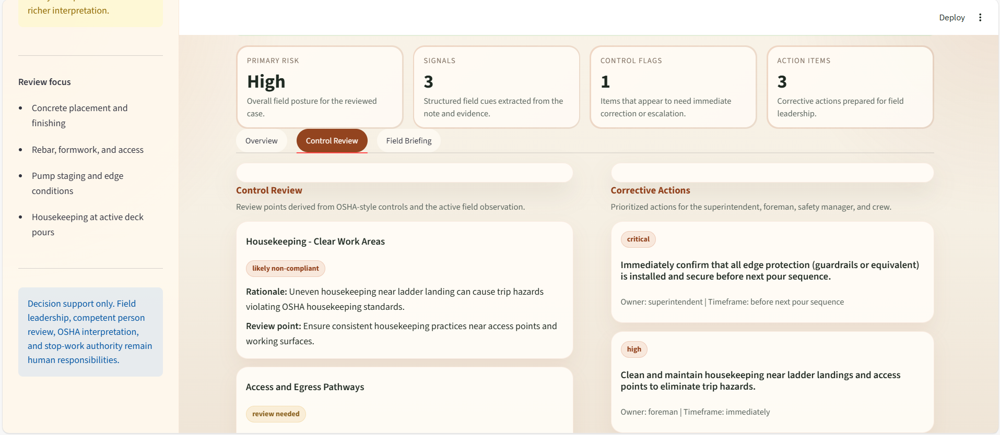
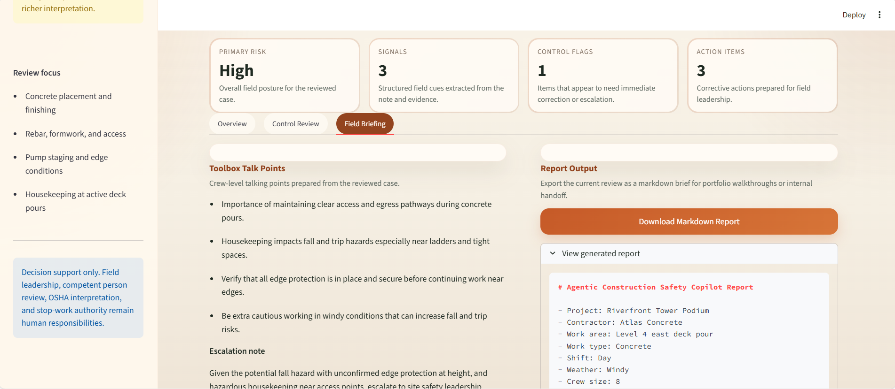

# Agentic Construction Safety Copilot

Agentic Construction Safety Copilot is a Streamlit-based safety review workspace for turning construction field observations into structured signals, risk assessment, control review findings, corrective actions, and toolbox-talk briefing points.

The product is designed around construction safety workflows rather than generic prompting. Users can load a realistic case by project type, review active field conditions, attach supporting site photos, and generate a supervisor-ready safety brief.

## Credit And Contributors

The main concept direction for this project was inspired by **Sharmin Jahan Badhan**.

- Concept inspiration: [Sharmin Jahan Badhan](https://github.com/sharmin3036)
- Productization, implementation, and portfolio adaptation: Reihaneh Samsami

## App Preview

Demo preview:


Full recording: [View the demo video](assets/media/demo-recording.mp4)

### Overview



### Intake And Case Summary



### Review Results



### Control Review



### Field Briefing



## What It Does

The application helps construction teams:

- review site observations by project type and field scenario
- extract structured field signals from observation notes
- assess likely risk posture and compounding factors
- review OSHA-style control gaps without overstating certainty
- prioritize corrective actions for superintendents, foremen, safety managers, and crews
- export the result as a markdown safety brief

## Core Workflow

1. Choose a project type such as building concrete, steel, civil, roofing, or MEP.
2. Load a realistic review case or enter a custom field observation.
3. Add project context, crew conditions, and optional supporting photos.
4. Run the safety review.
5. Review the resulting:
   - executive brief
   - field signals
   - control review findings
   - corrective actions
   - toolbox-talk points
6. Export the markdown report.

## Review Modes

### Sample Review Mode

Use Sample Review Mode for:

- portfolio demos
- consistent walkthroughs
- classroom or research presentations
- API-free screenshots and recordings

What it does:

- does not call the OpenAI API
- uses deterministic review logic tied to the active scenario
- produces stable safety outputs for repeatable demos

### Live Review Mode

Use Live Review Mode for:

- richer interpretation of field notes
- optional image-assisted review
- testing structured safety prompting with live API output

What it does:

- sends project context, observation notes, and optional images to the OpenAI API
- returns structured outputs for review findings and action planning
- uses API credits

## Review Library

The app includes starter cases grouped by project type:

- `Building - Concrete`
- `Building - Steel`
- `Civil / Bridge`
- `Roofing / Envelope`
- `MEP / Interiors`

These cases cover realistic conditions such as concrete deck pours, formwork and rebar access, bridge deck work, excavation and equipment separation, roof-edge staging, temporary power, and interior multi-trade overlap.

## Why This Project Matters

This project shows:

- applied agentic AI framing in a safety-critical domain
- product-oriented workflow design instead of a single prompt wrapper
- structured outputs for operational review
- safety-domain reasoning with explicit uncertainty
- real-world construction context across multiple project types
- human-in-the-loop positioning for decision support

## Tech Stack

- Python
- Streamlit
- OpenAI Responses API
- Pydantic
- python-dotenv
- Pillow
- imageio

## Project Structure

```text
.
|-- app.py
|-- requirements.txt
|-- .env.example
|-- .gitignore
|-- README.md
|-- assets
|   |-- media
|   |   |-- demo-preview.gif
|   |   `-- demo-recording.mp4
|   |-- screenshots
|   `-- sample-photos
|-- examples
|   `-- demo-observation.txt
`-- src
    |-- __init__.py
    |-- agent_workflow.py
    |-- knowledge_base.py
    |-- openai_client.py
    |-- reporting.py
    `-- schemas.py
```

## Setup

1. Create and activate a virtual environment.
2. Install dependencies:

```bash
pip install -r requirements.txt
```

3. Copy `.env.example` to `.env` and add your API key:

```env
OPENAI_API_KEY=your_api_key_here
OPENAI_MODEL=gpt-4.1-mini
```

4. Start the app:

```bash
streamlit run app.py
```

## Example Demo Flow

1. Open the app in `Sample review mode`.
2. Choose `Building - Concrete` and load `Concrete Deck Pour`.
3. Add supporting photos such as `Deck.jpg` and `Rebar.jpg`.
4. Run the safety review.
5. Walk through the overview, control review, and field briefing tabs.
6. Export the markdown report.

## Portfolio Positioning

This project can be described as:

`A construction safety review copilot that transforms field observations into structured signals, risk summaries, control-review findings, corrective actions, and toolbox-talk briefing output.`

Resume-ready bullets:

- Built a construction safety review application that organizes field cases by project type and produces structured review outputs for operations teams
- Designed deterministic and LLM-backed review modes for risk assessment, control review, corrective actions, and field briefing workflows
- Productized a safety-oriented AI workflow in Streamlit with scenario libraries, project-context intake, screenshot-ready dashboards, and markdown report export
- Adapted a student-inspired research direction into a portfolio-ready software product for construction safety decision support

## Notes

- This tool supports safety review and communication, but it does not replace site supervision, competent person review, OSHA interpretation, or stop-work authority.
- Sample Review Mode is the best option for consistent portfolio demos and GitHub media.
- Live Review Mode should still be treated as draft decision support, not autonomous enforcement.
